The slides and full report can be found here: [Wayfair Usability Report](https://docs.google.com/presentation/d/1BGB7DsPdYMby9_OjfXQmfyWM1KrShNPO6bpMLUPj0fo/edit?usp=sharing).

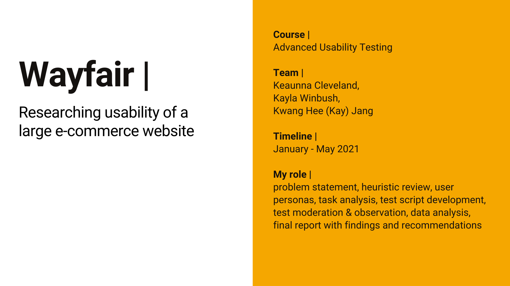

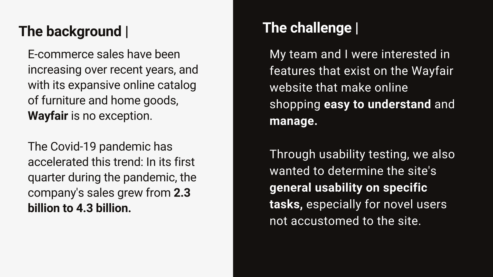

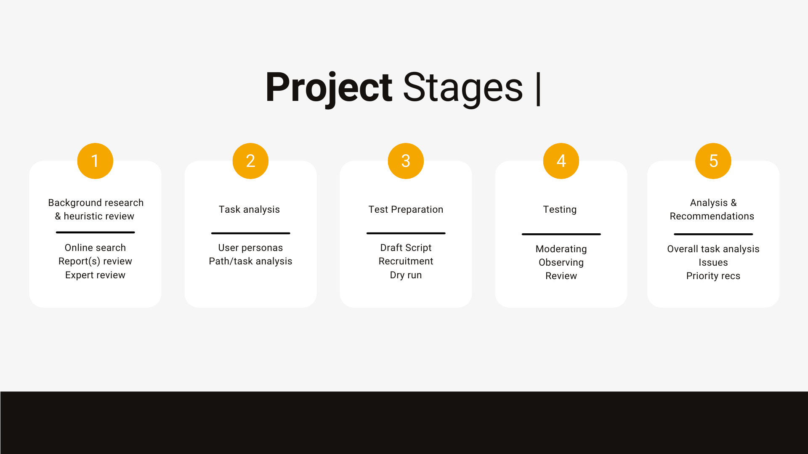

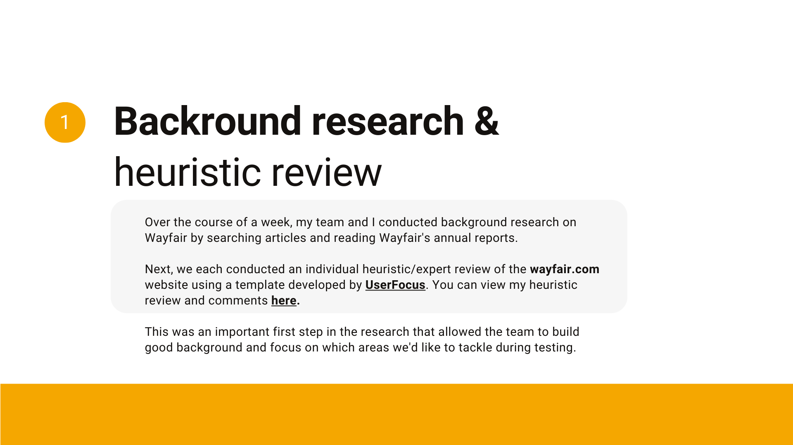

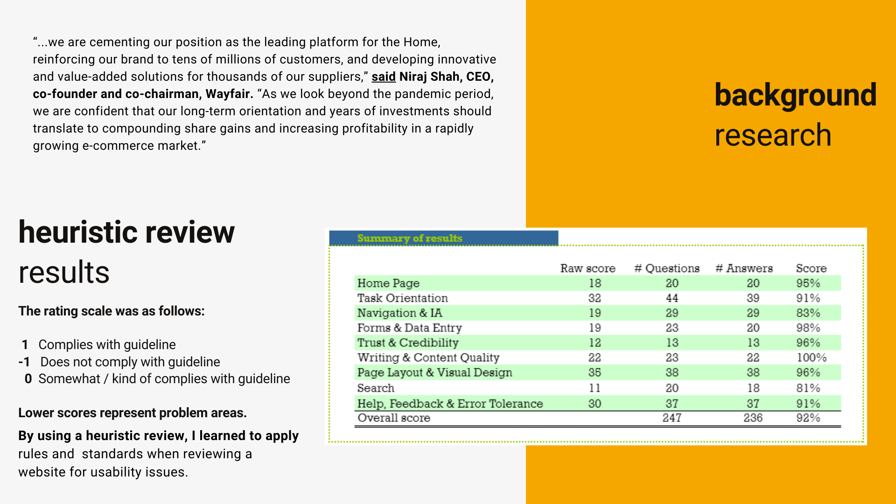

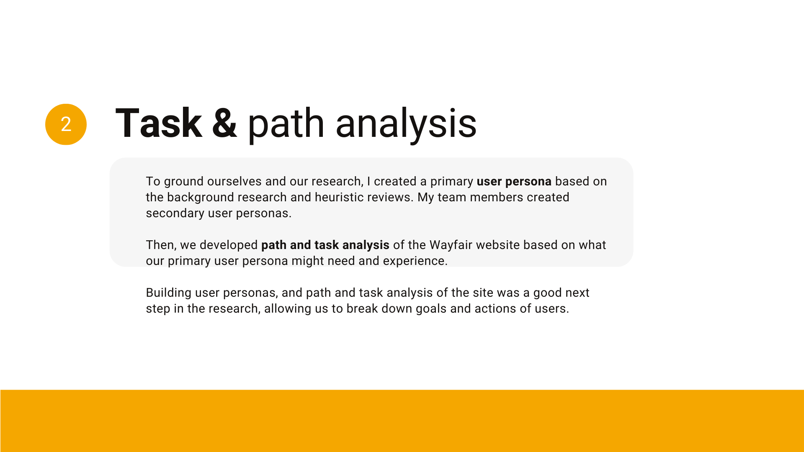

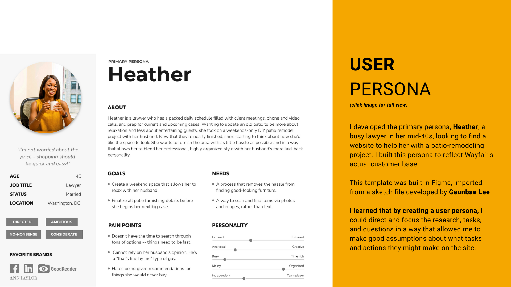

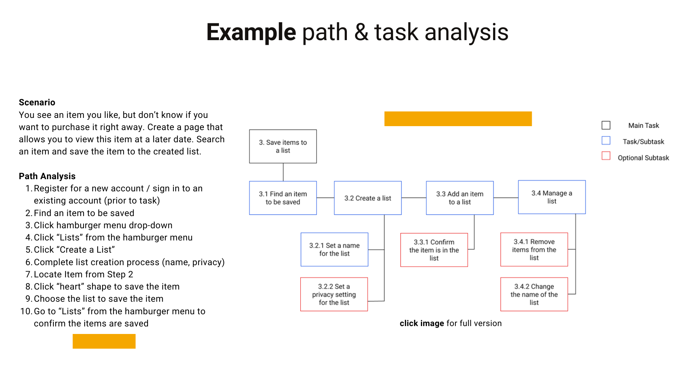

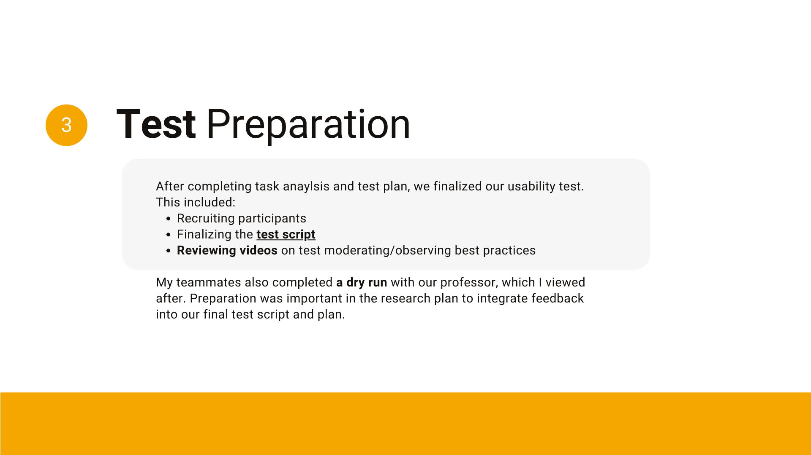

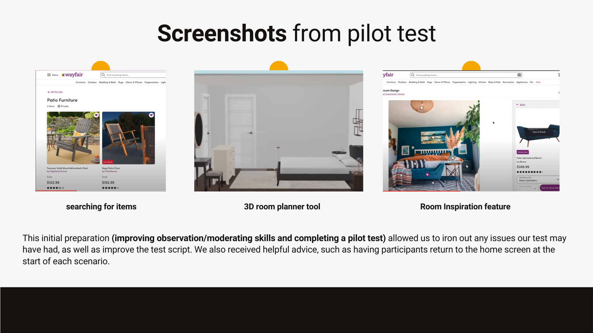

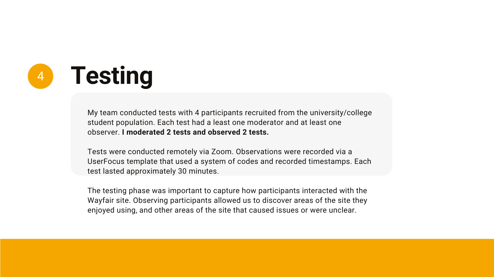

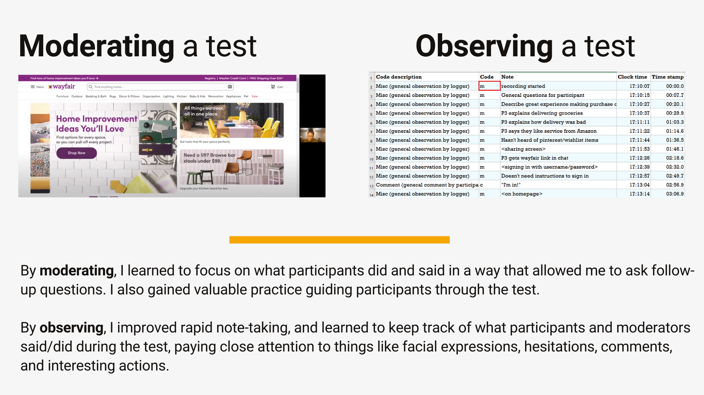

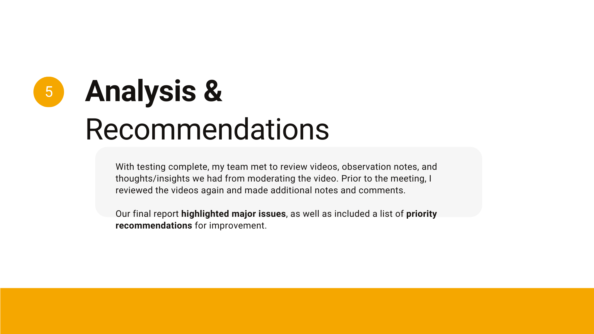

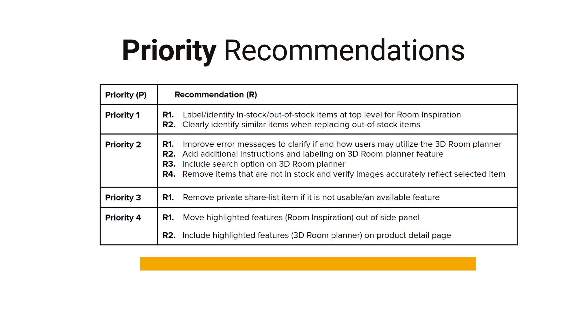

